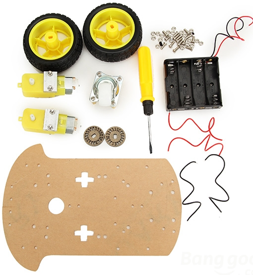
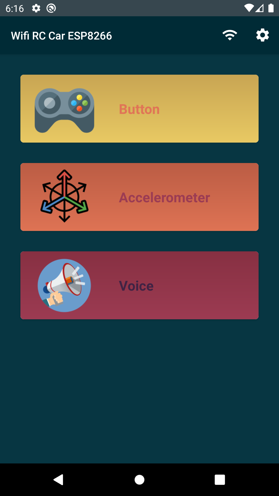
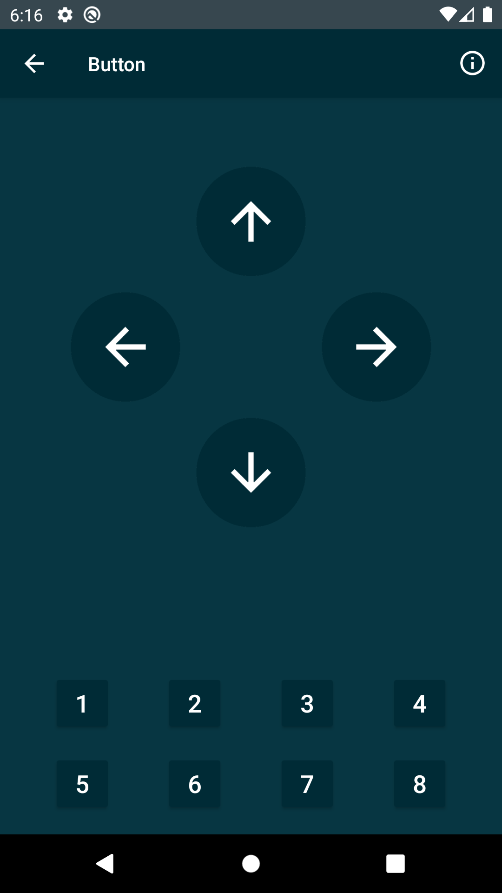

# Wifi car with ESP8266

<p align="center">

</p>


## Synopsis

There are a lot of RC car projects using a smartphone to control the car. Most of them use the bluetooth protocol. Thanks to the ESP8266 chip, reliable and cheap, it is now possible to build a RC car for about $30.
The steps are:
* build the wifi car
* develop the HTTP server with motor control
* develop the mobile application

## How it works

We are using HTTP protocol.

The server is the ESP8266 and the client is the smartphone. The client will send HTTP requests to the server in order to control the car.

ESP8266 chip is able to create its own WIFI network (Access Point mode = AP) or to connect to an existing wifi network (Station Mode = STA). It is also possible to deploy a HTTP server.

To make it simple, the smartphone must be connected to the same wifi network as the chip and know its ip address and the port of its server.

The user will interact with the buttons of the mobile application to control the car.

## Build your own wifi car

The first step is to build your wifi car. Basically, you have to assemble the chassis with 2 motors, connect the controller and the motor controller, add battery.

This is the most interesting part because you can customize your car by adding new features. In my case, I have replaced the chassis by a tank chassis.

<p align="center">

</p>

You can find a complete kit the build a wifi car at this [link](https://www.banggood.com/Geekcrei-2WD-L293D-WIFI-Smart-Robot-Car-With-NodeMCU-Shield-Kit-For-ESP-12E-Based-On-ESP8266-p-995166.html).

## Upload the code into your controller

The second step is to program your microcontroller in order to serve an HTTP server. The microcontroller would be able to control the rotation of each motors according to the request received. I decided to implement GET instead of POST request because the server will not return the state of the car.

I have made 2 scripts AP and STA modes. In AP mode, the microcontroller will create its own wifi network and serve the HTTP server. In STA mode, the microcontroller will connect to an existing network and server the HTTP server. In both case, you need to know the IP Address of your microcontroller.

To upload the script, you can use the Arduino IDE: [link](https://randomnerdtutorials.com/how-to-install-esp8266-board-arduino-ide/)

## Configure your mobile application

I have develop an Android app to control the wifi car. You can customize all the commands. To be totally honest, I have not found an application to properly control my car as Bluetooth RC car app. So I decided to create mine.

Connect your smartphone to the same wifi network as your wifi car. Make sure that the application parameters are correct (IP, PORT, etc..). Have fun!

The defaults commands sent are:

```
GET - http://192.168.4.1:8080/move?dir=F (forward)
GET - http://192.168.4.1:8080/move?dir=B (backward)
GET - http://192.168.4.1:8080/move?dir=R (right)
GET - http://192.168.4.1:8080/move?dir=L (left)
GET - http://192.168.4.1:8080/move?dir=S (stop)

GET - http://192.168.4.1:8080/action?type=1 (action 1)
...
GET - http://192.168.4.1:8080/action?type=8 (action 8)
```

__Android__:
<p align="center">
  
  
  
</p>


[](https://play.google.com/store/apps/details?id=com.lacour.vincent.wificaresp8266)


__iOS__:
<p align="center">
  
  
  
</p>

## Preview

You can find the result my project at this [link](https://www.youtube.com/watch?v=E-RyAsFMnTI)
