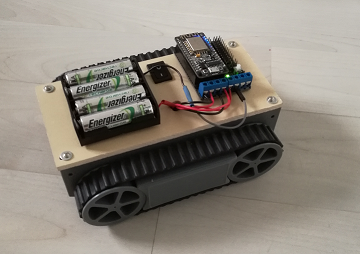

# Wifi Car ESP8266 using NodeMCU V3.

### Synopsis

Simple code to control a **Wifi Car** with NodeMCU V3 microcontroller (Arduino IDE).

### Prerequisites

The program can be uploaded from the Arduino IDE in the NodeMCU controller. In this project, I used:

```
Arduino IDE
NodeMCU ESP8266-12E
NodeMCU Motor Shield
Robot Car Chassis
Micro USB Cable
Battery
Android Device
```


### Where to buy ?

* [Complete Kit from Banggood](https://www.banggood.com/Geekcreit-Doit-2WD-L293D-WIFI-RC-Smart-Car-With-NodeMCU-Shield-For-ESP-12E-Based-On-ESP8266-p-995166.html?p=6R31122484684201508S&utm_content=zhangruihua&utm_campaign=esp&cur_warehouse=CN) (~USD $23)
* [Motor Shield for NodeMCU V1.0](https://www.banggood.com/ESP8266-WiFi-Motor-Drive-Expansion-Board-For-NodeMCU-ESP-12E-p-991603.html?p=6R31122484684201508S&utm_content=zhangruihua&utm_campaign=esp) (~USD $5.30)
* [Kit NodeMCU + MotorShield](https://www.banggood.com/NodeMcu-Lua-ESP8266-ESP-12E-and-WiFi-Motor-Drive-Expansion-Board-p-995417.html?p=6R31122484684201508S&utm_content=zhangruihua&utm_campaign=esp) (~USD $11.60)
* [Smart Car Kit](https://www.banggood.com/Smart-Robot-Car-Chassis-Kit-Speed-Encoder-Battery-Box-For-Arduino-p-981975.html?p=6R31122484684201508S&utm_content=zhangruihua&utm_campaign=esp) (~USD $12)


### Android App

You can download my Android application to control the Wifi RC Car [here](https://play.google.com/store/apps/details?id=com.lacour.vincent.wificaresp8266&hl=fr)


### Preview
[](https://www.youtube.com/watch?v=E-RyAsFMnTI)

<p align="center">

</p>
